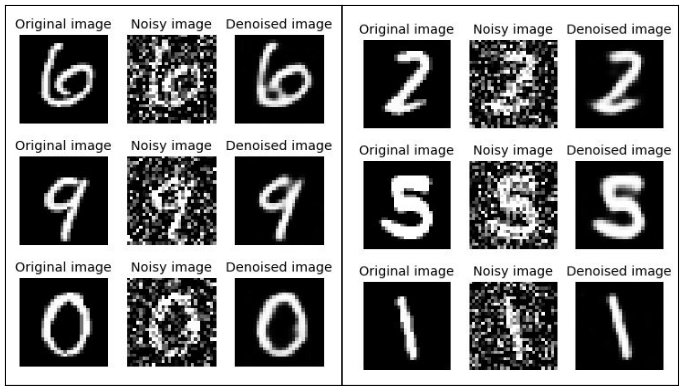

# Denoising Images by using an Autoencoder

One of the fundamental challenges in the field of Image Processing and Computer Vision is Image Denoising, where the underlying goal is to estimate the original image by suppressing noise from a noise-contaminated version of the image. Image noise may be caused by different intrinsic (i.e., sensor) and extrinsic (i.e., environment) conditions which are often not possible to avoid in practical situations.

Therefore, Image Denoising plays an important role in a wide range of applications such as Image Restoration, Visual Tracking, Image Registration, Image Segmentation and Image Classification, where obtaining the original image content is crucial for strong performance. Here we examine an approach to solve the problem of image denoising based on Autoencoders using the Modified National Institute of Standards and Technology (MNIST) dataset.

- [Case Study](https://drive.google.com/file/d/1TWMdk2CoU3d9am_DsK7_J_Ql53xyYbJg/view?usp=sharing)

## Architecture

## Results

